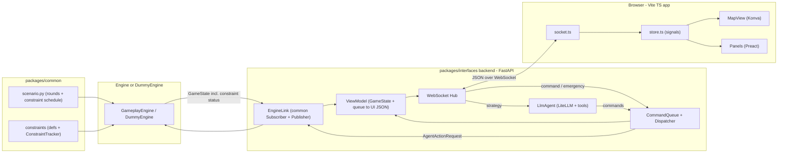

# RTS and LLM Web Interface Architecture

## 1. Review findings (existing code)

What the interface can reuse as-is:
- `[packages/common/src/common/publisher.py](packages/common/src/common/publisher.py)` and `subscriber.py`, with both Local and Socket variants. The backend uses these to subscribe to `GameState` and publish `AgentActionRequest`.
- `GameState`, `AgentState`, `AgentAction`, the action dataclasses, and `TileState` (the `Convertible` pattern).
- The `just` + `uv` workspace layout. `packages/interfaces` joins the workspace automatically through `packages/*`.

Gaps that block the design requirements (fix while building):
- `[protos/common/protos/agent_state.proto](protos/common/protos/agent_state.proto)` only has `id`, `position`, and `busy`. The UI also needs `role`, `health`, `current_action`, and `action_time_remaining`.
- `[protos/common/protos/game_state.proto](protos/common/protos/game_state.proto)` has no `time_remaining`, enemies, objectives, or constraints. Constraints are covered in section 3.
- There is no stop action. Emergency stop can be built from a `MoveAction` to each robot's current position, but a `StopAction` proto would be cleaner.

Small engine bugs found while reviewing (outside the interface package, listed for awareness):
- `InputSystem` reads `data.agent_actions`, but the proto field is `actions`.
- `GameplayEngine.get_game_state` passes `agent_positions=`, which `GameState.__init__` doesn't accept.
- `StateBroadcastSystem` duplicates `SocketPublisher`.

## 2. System architecture



Key decisions:
- **The backend owns the command queue.** The engine only knows each robot's current action. The backend keeps a per-robot queue with three statuses (waiting, in progress, done) and sends the next action when a robot reports `busy=False`. This one module provides "current and upcoming actions," drawn paths (a sequence of `MoveAction`s), and the LLM command queue panel.
- **The engine is the authority on constraints.** Violations change the score, so evaluation runs next to scoring, in whichever engine is active. The logic lives in `common` so the real engine and the dummy engine share it. The interface never evaluates constraints; it only renders the status it receives.
- **One frontend, two modes.** The URL selects the mode (`/?mode=rts` or `/?mode=llm`) to support the counterbalanced study. Both modes share the shell: status bar, map, video, robot panel, selection panel, constraint panel, and emergency controls. RTS mode adds the command toolbar and map tools. LLM mode adds the strategy panel and command queue panel.
- **Browser traffic is JSON, not protobuf.** The backend converts protos with `google.protobuf.json_format.MessageToDict`, which reuses the existing schema with no TypeScript protobuf toolchain. Messages that exist only in the UI are Pydantic models, mirrored in one `types.ts` file.
- **Swapping the engine is just configuration.** `EngineLink` takes any `Subscriber`/`Publisher`. Local variants with `DummyEngine` cover testing, and Socket variants connect to the real engine.

WebSocket protocol (small and flat):
- Server to client: `{type:"state", data}` at about 15 Hz (includes constraints and their status), `{type:"queue", data}` whenever the queue changes, `{type:"llm", data}` for strategy status and reasoning.
- Client to server: `{type:"command", robot_ids, action:{kind, target}, append:bool}`, `{type:"emergency", kind:"stop"|"retreat"}`, `{type:"strategy", text}`.

## 3. Constraints (from [packages/interfaces/constraints.md](packages/interfaces/constraints.md))

The open study-design questions (how many constraints per round, same or different across interfaces and participants, difficulty ramp) are settled by **scenario files, not code**. Running every participant and both interfaces with the same scenario file gives the cleanest data, and the difficulty ramp (none, then easy, then hard) is just the order of rounds in the file.

### Data model (`packages/common/src/common/constraints/`)

- `Zone`: an axis-aligned rectangle or a circle in arena coordinates, with a `contains(x, y)` method. No geometry library is needed for these shapes.
- `Constraint` base dataclass: `id`, `kind`, `label`, `difficulty`, `penalty`, `active_from_s`, `active_until_s`. The time window lets a constraint be imposed partway through a round.
- First-build kinds:
  - `RestrictedZone(zones)`: robots may not enter.
  - `OccupationZone(zones, min_robots=1)`: at least N friendly robots must always be inside.
  - `TimedEntryZone(zones, max_dwell_s)`: each robot may stay inside at most `max_dwell_s`.
- Phase 2 kinds: `ActivityInterval(max_active_s, base_zone)` and `RoleRestriction(action_kinds, allowed_roles)`. The data model leaves room for the remaining types in the doc (participation limit, minimum requirement, overwatch, waypoint deadline, contact, protection) without changing the architecture.

### Evaluation (`ConstraintTracker`)

- `tracker.update(t, agent_states) -> list[ConstraintStatus]` is a pure Python class holding per-robot timers (dwell time, and active time in phase 2).
- `ConstraintStatus` has `constraint_id`, `state` (`ok`, `warning`, or `violated`), `offending_robot_ids`, `timers` (for example, seconds of dwell left per robot), `violation_count`, and `points_lost`.
- Penalties are **edge-triggered**. The doc says "each time a robot violates a constraint," so a penalty applies when a robot enters the violated state, not on every tick it stays there. The `warning` state (for example, dwell time over 75%) lets the UI warn the user before a violation.

### Protos

- New file `protos/common/protos/constraint.proto` with `Zone` (a `oneof` of rect and circle), `Constraint` (common fields plus a `oneof` per kind), and `ConstraintStatus`.
- `GameState` gains `repeated Constraint active_constraints` and `repeated ConstraintStatus constraint_statuses`. Each gets a matching `Convertible` wrapper in `common`, following the existing pattern.

### Scenario files (`packages/common/src/common/scenario.py`)

- The format is JSON, loaded with the standard library, so `common` gets no new dependency. A file holds `seed`, `n_robots`, `robot_speed`, and a list of rounds. Each round has a `duration_s` and its constraints with their activation times.
- An optional `random_pool` per round, combined with the seed, picks a constraint at random while staying reproducible across participants.
- Example file: `packages/interfaces/scenarios/pilot.json`.

### How the UI shows constraints (both modes)

- **Map constraint layer (Konva):**
  - Restricted zones are a red hatched fill.
  - Occupation zones have a dashed outline that is green while held and red while not, with an "N/M robots" label.
  - Timed-entry zones are amber, and robots inside them get a countdown ring.
- **Robots:** a red badge and pulse on any robot in `offending_robot_ids`. Critical failures also appear in `RobotList`.
- **`ConstraintPanel`:** lists active constraints with a plain-language description, a state chip, timers, and violations so far with points lost.
- **Activation banner:** shown when a new constraint becomes active partway through a round, so the change is never silent.
- **Violation feedback:** a brief screen-edge flash plus an entry in the panel.
- **RTS path preview:** a waypoint or drawn path that crosses a restricted zone renders red before the user commits it. This needs only a small rect/circle hit test in TypeScript, which is display-only and not authoritative.
- **LLM mode:** `llm/prompt.py` includes each active constraint's description and live status, so the LLM can plan around constraints. The strategy panel shows the same `ConstraintPanel`.

## 4. Libraries (reused instead of writing new code)

Backend (Python):
- `fastapi` + `uvicorn[standard]`: HTTP, WebSocket, and static file serving for the built frontend.
- `pydantic` (comes with FastAPI): wire models and config.
- `litellm`: provider-agnostic LLM calls with tool/function calling.
- `protobuf` `json_format`: converts protos to JSON.
- Constraints and scenarios use only the standard library (`dataclasses`, `json`).

Frontend (TypeScript):
- `vite`: dev server and build. The dev server proxies `/ws` to FastAPI.
- `preact` + `@preact/signals`: tiny component and reactive-state layer, with no Redux.
- `konva`: canvas scene graph with hit-testing, drag, and layers. Box-select, drag-path, and hatched fills (`fillPatternImage`) follow documented Konva patterns.
- `partysocket`: auto-reconnecting WebSocket.
- `tinykeys`: hotkeys (shift and ctrl modifiers, emergency stop key).
- `@picocss/pico`: classless base styling, so there's no CSS framework to learn.
- Video: a plain `` (MJPEG) or `<video>` element behind a `VideoPanel` that takes a stream URL. Add `hls.js` only if the Robotarium feed turns out to be HLS.

## 5. Package layout

```
protos/common/protos/
  constraint.proto            # new: Zone, Constraint, ConstraintStatus
packages/common/src/common/
  constraints/
    __init__.py
    zone.py                   # Zone (rect / circle), contains()
    definitions.py            # Constraint base + RestrictedZone, OccupationZone, TimedEntryZone
    tracker.py                # ConstraintTracker -> ConstraintStatus (edge-triggered penalties)
  scenario.py                 # load JSON scenario: rounds, constraint schedule, seed
packages/interfaces/
  design.md, constraints.md
  pyproject.toml              # fastapi, uvicorn, litellm, common
  scenarios/pilot.json        # example: no constraint, then easy, then medium
  src/interfaces/
    __init__.py               # main(): run uvicorn
    config.py                 # pydantic-settings: ports, mode, scenario path, LLM model, video URL
    server.py                 # FastAPI app, /ws endpoint, static mount of web/dist
    hub.py                    # connection set + broadcast
    engine_link.py            # wraps common Subscriber/Publisher, async poll loop
    commands.py               # Command model, CommandQueue, Dispatcher, emergency macros
    view_model.py             # GameState + queue -> UI JSON
    llm/
      prompt.py               # state + constraints -> compact text for the LLM
      tools.py                # tool schemas mapped to Command objects
      agent.py                # strategy loop using litellm
    sim/
      dummy_engine.py         # scenario-driven robots, speed, timed actions, ConstraintTracker, scoring
  tests/                      # queue, view_model, dummy engine, llm tool parsing
  web/
    package.json, vite.config.ts, index.html
    src/
      main.ts                 # reads ?mode, mounts the shell
      types.ts                # mirrors backend wire models
      api/socket.ts           # partysocket wrapper, send helpers
      state/store.ts          # signals: gameState, selection, queue, llm, constraints
      theme.ts                # blue role shades, enemy/resource/constraint/violation colors
      map/MapView.ts          # Konva stage: terrain, constraints, entities, intents, interaction layers
      map/constraintLayer.ts  # zone rendering per constraint kind + state
      map/geometry.ts         # display-only rect/circle hit test for path preview
      map/selection.ts        # pure logic for click, shift/ctrl, toggle, and box select
      map/tools.ts            # waypoint, draw path, click-to-action
      panels/                 # StatusBar, RobotList, SelectionPanel, CommandBar, EmergencyControls,
                              # VideoPanel, ConstraintPanel, ConstraintBanner, StrategyPanel, CommandQueuePanel
packages/common/tests/
  test_constraints.py         # zone hit tests, dwell timers, edge-triggered penalties
  test_scenario.py
```

Map layers, from bottom to top:
- Terrain and resources: from the `TileState` grid.
- Constraint zones: drawn per kind and state, as described in section 3.
- Entities: robots in role-based blue shades with health rings, selection outlines, and violation badges. Enemies and objectives also go here.
- Intent overlay: destination, path polyline, and an action-progress arc.
- Interaction layer: the selection rectangle and in-progress path drawing.

## 6. Build phases

1. **Scaffolding.** Create `pyproject.toml` and the Vite app. Add `just` recipes: `interfaces-dev` (uvicorn plus vite), `interfaces-build`, and `dummy-engine`.
2. **Protos.** Add the agent and game state fields, plus `constraint.proto`, then regenerate with `just init`.
3. **Constraints and scenarios in `common`.** Build the zone, definition, and tracker modules, the scenario loader, and their tests.
4. **Dummy engine and EngineLink.** The dummy engine runs a scenario, applies the testing rules from the design doc, runs the `ConstraintTracker`, and deducts penalties from the score. This is all on Local pub/sub, so no robots are needed.
5. **Backend core.** Build `CommandQueue`, `ViewModel`, the hub, and the `/ws` endpoint, with unit tests.
6. **Frontend shell.** Add the socket, store, status bar, read-only map, robot list, and video placeholder.
7. **Constraint UI.** Add the constraint layer, `ConstraintPanel`, activation banner, and violation feedback.
8. **RTS interactions.** Add selection logic, map tools with the red path preview, the command toolbar, and emergency controls.
9. **LLM mode.** Add prompt serialization (with constraints), tool schemas, the LiteLLM agent loop, the strategy panel, and the command queue panel.
10. **Constraints phase 2.** Add `ActivityInterval` (return-to-base timer ring per robot) and `RoleRestriction` (role-aware command validation and greyed-out actions in `CommandBar`).
11. **Polish.** Hotkeys, reconnection handling, and visual tuning.
