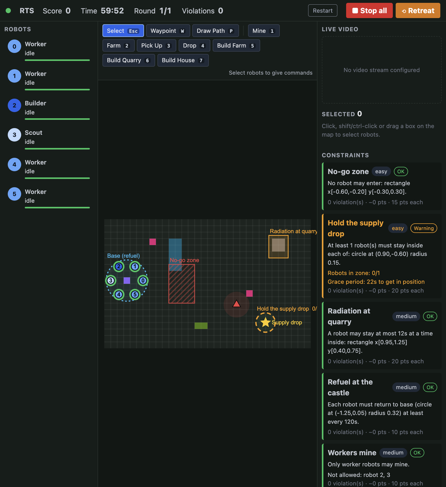

# Interfaces

Web interfaces for commanding a swarm of real (Robotarium) robots in a
real-time strategy game. There are two interfaces for comparing in a user study:

- **RTS interface** (`?mode=rts`): the operator selects robots and gives
  direct commands (waypoints, paths, actions on map tiles), like a classic RTS.
- **LLM interface** (`?mode=llm`): the operator types an overarching strategy;
  an LLM turns it into robot commands, which the operator monitors.

Both share one FastAPI backend, one browser frontend, the same map, and the
same constraint system (rules like "no robot may enter this zone" that cost
points when violated). A dummy engine simulates the robots so everything runs
without hardware.



## Quick start

```bash
just init                # generate protos, install python deps
just interfaces-install  # install frontend deps (npm)
just interfaces-dev      # backend on :8000 + frontend dev server on :5173
```

Open <http://localhost:5173/?mode=rts> or <http://localhost:5173/?mode=llm>.
For the LLM interface, export a provider key first (e.g. `OPENAI_API_KEY`).

## Documentation

| Document | Contents |
| --- | --- |
| [docs/architecture.md](docs/architecture.md) | Code and file structure, data flow, message protocol |
| [docs/running.md](docs/running.md) | Running for development, study sessions, and against the real engine; configuration |
| [docs/developing.md](docs/developing.md) | Developing: LLM integration, game rules and mechanics, constraints, scenarios, frontend, tests |
| [docs/interface.md](docs/interface.md) | What every visual element means and how the interface behaves |

Requirements live in [design.md](design.md) and [constraints.md](constraints.md).

## Tests

```bash
just test common        # constraints, scenarios, protos
just test interfaces    # command queue, dummy engine, server, LLM agent
cd packages/interfaces/web && npm test   # map geometry and selection
```

## Handoff notes

### What was built

- **Two web interfaces sharing one backend and one map:**
  - **RTS mode** (`?mode=rts`): select robots and give direct commands (waypoints, drawn paths, actions on tiles, right-click smart commands, hotkeys).
  - **LLM mode** (`?mode=llm`): the operator types a strategy, the LLM turns it into robot commands, and the operator watches a live command queue and the LLM's log.
- **Constraint system** in `packages/common/src/common/constraints/`. It has 5 kinds: restricted zone, occupation zone, timed-entry zone, activity interval (refuel) and role restriction. Each has OK, warning and violated states, and penalties are charged once when a violation starts. The engine evaluates constraints and the UI only renders them.
- **Scenario files** (`scenarios/*.json`) define a whole session in one file: map, robots and roles, speeds, action durations, points, enemies, objectives, and rounds with constraint schedules. They also support seeded random constraints, so every participant gets the same draws.
- **Extended protos** in `protos/common/protos/`: `AgentState` now has role, health, current action and its timing, target, failure and cargo. `GameState` now has rounds, time, arena, enemies, objectives, active constraints and their live status. There are also new `constraint.proto` and `entity.proto` files.
- **A dummy engine** (`src/interfaces/sim/dummy_engine.py`) that simulates robots, so everything runs without hardware. It uses the same publisher/subscriber protocol as the real engine.
- **Tests** for common, interfaces and the frontend; all pass.

To try it with every constraint kind active at once:

```bash
INTERFACES_SCENARIO=packages/interfaces/scenarios/sandbox.json just interfaces-dev
```

### Next steps: game engine

1. **Get the real engine publishing the new `GameState`.** `packages/engine/src/engine/gameplay_engine.py` still calls `GameState(agent_positions=...)`, but the signature is now `GameState(agent_states=...)`. That needs fixing before the engine can drive the UI.
2. **Meet the interface contract.** The backend only needs three things from the engine:
   - Accept an `AgentActionRequest` (one action per robot, replacing its current one).
   - Report each robot's `busy` flag accurately. The backend's command queue starts a robot's next command when it turns false.
   - Publish `GameState` with `active_constraints` and `constraint_statuses`, by calling `ConstraintTracker.update(t, dt, agent_states)` every tick and subtracting `tracker.total_points_lost` from the score.

   `dummy_engine.py` is a compact reference for all three. The extra `AgentState` fields (role, health, current action, timing, cargo) are optional, but the UI shows them.
3. **Test over sockets.** Run `INTERFACES_ENGINE=socket just interfaces-dev`. The backend listens on 5100 for state and sends actions to 5101; both are configurable (see [docs/running.md](docs/running.md)).
4. **Build the real rounds.** Edit `scenarios/pilot.json`, or make new scenario files. The full format and a constraint table are in [docs/developing.md](docs/developing.md), under "Adjusting game rules and mechanics".
5. **Keep rules consistent.** If action effects or scoring change, the dummy engine's `TILE_RULES` and the LLM's `SYSTEM_PROMPT` should match. New constraint kinds or actions have step-by-step checklists in the same doc.

### Next steps: LLM

All the LLM code is in `src/interfaces/llm/`:

- `agent.py` decides when to plan: on a new strategy, when a new constraint appears, or when robots sit idle (`INTERFACES_LLM_REPLAN_S`, default 20s). It makes one LiteLLM call with tools per plan, and emergencies pause planning.
- `prompt.py` holds the system prompt and `describe_state()`, which turns the same JSON view the UI renders into text. This includes every constraint with its status, offending robots and timers.
- `tools.py` holds the tool schemas (`queue_command`, `clear_commands`) and how each call becomes queued commands.

Things to do:

1. **Pick a model.** Set `INTERFACES_LLM_MODEL` to any LiteLLM model string, plus the provider's key (e.g. `OPENAI_API_KEY`). The default is `gpt-4o-mini`. Local models through Ollama work too.
2. **Improve the prompt and state description.** Anything the UI shows is already in the view the LLM gets.
3. **Add tools** such as hold position or patrol. There's a worked example in [docs/developing.md](docs/developing.md).
4. **Replace the planning approach.** `LlmAgent` accepts a custom `completion` function: structured output, multi-step reasoning, another SDK, and so on.
5. **Test without API calls.** `tests/test_llm.py` uses a fake completion, so you can test offline.

The strategy panel in LLM mode shows the LLM's reasoning, every command it issued, and any rejected tool calls, which helps when debugging.
