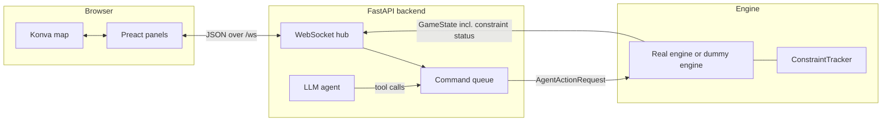

# Architecture

## Overview



Responsibilities are split so each piece stays simple:

- **Engine** (real or dummy) is the authority on the game: robot positions,
  tiles, score, rounds, and **constraint evaluation and penalties**. It only
  knows each robot's *current* action.
- **Backend** owns the **command queue** (each robot's current and upcoming
  commands), feeds the next command to a robot when it finishes, runs the
  **LLM agent**, and broadcasts the game view to all browsers ~15 times/s.
- **Frontend** renders the view and turns operator input into commands. It
  never evaluates rules itself (except a display-only preview that turns a
  path red when it crosses a restricted zone).

## File structure

Everything added for the interfaces lives in `packages/interfaces/` and
`packages/common/`. Shared protobuf definitions live in `protos/`.

```text
protos/common/protos/
  constraint.proto        Zone shapes, the 5 constraint kinds, ConstraintStatus
  entity.proto            Enemies / objectives on the map
  agent_state.proto       + role, health, current action + timing, target, failure, carrying
  game_state.proto        + time, rounds, arena, entities, constraints, statuses

packages/common/src/common/
  agent_state.py          AgentState (extended fields above)
  game_state.py           GameState (extended fields above)
  arena.py                Arena bounds + tile <-> world math (Robotarium: 3.2 x 2.0 m)
  entity.py               Entity (enemy / objective)
  scenario.py             Scenario JSON loader: map, robots, rules, rounds, constraints
  constraints/
    zone.py               RectZone, CircleZone
    definitions.py        Constraint base class + the 5 kinds, ConstraintStatus
    tracker.py            ConstraintTracker: evaluates each tick, edge-triggered penalties

packages/interfaces/
  design.md, constraints.md   Requirements
  scenarios/
    pilot.json            3 rounds of increasing difficulty (for studies)
    sandbox.json          1 long round with every constraint kind (for development)
  src/interfaces/
    __init__.py           `interfaces` command: serves backend + built frontend
    config.py             Settings from INTERFACES_* environment variables
    server.py             FastAPI app, WebSocket endpoint, tick loop, message handling
    hub.py                Tracks connected browsers, broadcasts messages
    engine_link.py        Publisher/Subscriber pair to the engine (local or socket)
    commands.py           CommandQueue: per-robot queues, dispatch, emergency stop/retreat
    actions.py            Action kind strings <-> common action classes
    view_model.py         GameState + queue -> JSON view sent to browsers and the LLM
    llm/
      agent.py            LlmAgent: when to plan, calls the model, applies tool calls
      prompt.py           System prompt + text description of the game state
      tools.py            Tool schemas (queue_command, clear_commands) + their effect
    sim/
      dummy_engine.py     Stand-in engine: movement, timed actions, items, enemies, rounds
  tests/                  pytest suites for all of the above
  web/                    Frontend (Vite + TypeScript + Preact + Konva)
    index.html
    vite.config.ts        Dev server; proxies /api and /ws to the backend
    src/
      main.tsx            Entry: connect, bind hotkeys, render
      App.tsx             Layout; picks panels by mode
      types.ts            Wire types (mirror of the backend JSON)
      theme.ts            Colors for roles, tiles, items, states
      hotkeys.ts          Keyboard shortcuts (tinykeys)
      state/store.ts      Global state as signals (game, queue, llm, selection, tool, notices)
      api/socket.ts       Reconnecting WebSocket; `api.command/emergency/strategy/clear/restart`
      map/
        MapView.ts        Konva stage: terrain, zones, intents, robots/entities, overlays
        constraintLayer.ts Zone drawing per constraint kind + per-robot countdown rings
        tools.ts          Mouse interaction: select, waypoint, path, action tools, right-click
        selection.ts      Pure selection logic (click, box, hit testing)
        geometry.ts       World <-> screen transform, tile math, zone hit tests
      panels/             One component per UI panel (see interface.md)
```

## Libraries

| Concern | Library |
| --- | --- |
| HTTP + WebSocket server | FastAPI, uvicorn |
| Configuration | pydantic-settings |
| LLM providers | LiteLLM (one API for OpenAI, Anthropic, local models, ...) |
| Engine messages | protobuf + the existing common Publisher/Subscriber |
| UI components / state | Preact + @preact/signals |
| 2D map | Konva |
| WebSocket reconnects | partysocket |
| Hotkeys | tinykeys |
| Base styling | Pico CSS |
| Build / tests | Vite, vitest, pytest |

## Data flow per tick

1. The engine publishes a `GameState` (via the common Publisher).
2. `Context.tick()` in `server.py` reads the latest state from the `EngineLink`.
3. `CommandQueue.dispatch(state)` marks finished commands done (robot reports
   `busy=False`) and returns the next action for each free robot; these go to
   the engine as one `AgentActionRequest`.
4. `build_view(state, queue)` converts the state to JSON and attaches each
   robot's `plan` (current + waiting commands).
5. The view is broadcast to every browser and handed to `LlmAgent.observe()`,
   which decides whether to re-plan.
6. If the queue changed, a queue snapshot is broadcast too.

## Message protocol

Browser ↔ backend messages are JSON over `GET /ws`.

**Server → browser**

| `type` | `data` | When |
| --- | --- | --- |
| `state` | Game view: `GameState` fields in snake_case, plus `plan` per agent | Every tick |
| `queue` | `{in_progress, waiting, history}` lists of commands | When the queue changes, and on connect |
| `llm` | `{model, strategy, paused, status, error, log}` | When the agent's state changes, and on connect |
| `error` | `{message}` | A client message was invalid |

In the view, `tiles` is the `(width, height)` grid flattened row-major
(`index = i * height + j`), and constraint `timers` are keyed by robot id
as strings.

**Browser → server**

```jsonc
{"type": "command", "robot_ids": [0, 2], "action": {"kind": "mine", "target": [26, 15]}, "append": false}
{"type": "emergency", "kind": "stop"}          // or "retreat"
{"type": "strategy", "text": "Two robots mine, the rest hold the supply drop"}
{"type": "clear", "robot_ids": [0]}            // omit robot_ids to clear everyone
```

`move` targets are world coordinates in meters; every other action targets a
tile `(i, j)`. `append: false` replaces the robots' queues, `true` adds to the end.

**HTTP**

- `GET /api/config`: `{mode, engine, video_url, llm_model, action_kinds}`
- `POST /api/restart`: reload the scenario file and restart the game (dummy engine only)

## Coordinates

The arena is the Robotarium testbed: x ∈ [-1.6, 1.6] m, y ∈ [-1.0, 1.0] m,
y pointing up. It is divided into a 32 × 20 tile grid (configurable per
scenario); tile `(i, j)` has `i` along x and `j` along y, so tile (0, 0) is
bottom-left. `common/arena.py` and `web/src/map/geometry.ts` implement the
same tile math.
