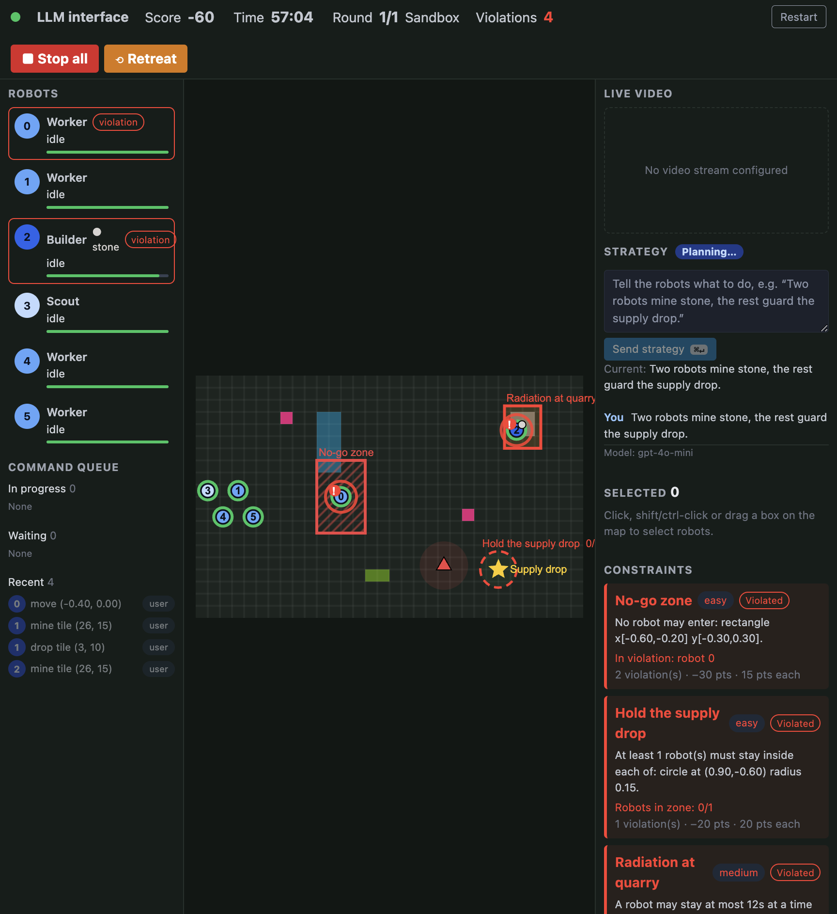

# The interface

Both interfaces share one layout. Panels marked *RTS* or *LLM* appear only in
that interface.

| Area | Contents |
| --- | --- |
| Top | Status bar and emergency controls |
| Left | Robot list; *LLM*: command queue |
| Center | *RTS*: command toolbar; the map; constraint banners |
| Right | Live video, *LLM*: strategy panel, selection, constraints |

## Status bar

- **Connection dot**: green when connected, red when the connection is lost
  (the map is then covered by a "Connection lost — reconnecting…" overlay;
  it reconnects automatically).
- **Mode**: RTS or LLM.
- **Score**: points earned minus constraint penalties.
- **Time**: time left in the round (amber in the last 20 s).
- **Round**: current/total and the round name.
- **Violations**: total violations this game (red when above zero).
- **Restart** (dummy engine only): restarts from round 1 after a confirmation.
- **Stop all** (`X`): cancels every robot's commands and holds position.
- **Retreat** (`R`): cancels everything and sends all robots to the castle.
  Both work in either interface; in the LLM interface they also pause the LLM
  until a new strategy is sent.

## Map

The map shows the whole arena, scaled to fit, with y pointing up.

### Terrain

| Color | Tile |
| --- | --- |
| Purple | Castle: drop items here to score |
| Grey-brown | Quarry: mine for stone |
| Green | Farm: farm for food |
| Pink | Apple: pick up an apple |
| Teal | Water |
| Black | Obscured |

### Robots

Friendly robots are blue circles labeled with their id; each role is a
different shade of blue (worker light blue, builder dark blue, scout pale
blue). Around each robot, from the inside out:

- **Health arc**: green → amber → red as health drops. A disabled robot turns
  grey with an ✕ and can't be selected.
- **Work progress arc** (white): fills while the robot performs a timed action.
- **Countdown rings**: one per timed constraint affecting the robot, shrinking
  as time runs out — amber for time left in a timed zone, cyan for time left
  until it must refuel at base. They turn red in the last quarter.
- **Violation pulse**: a pulsing red ring plus a red "!" badge while the robot
  is violating a constraint.
- **Selection**: a white outline.
- **Cargo**: a small dot at the top right (light grey stone, lime food, pink apple).

### Plans

Each robot's queued commands are drawn as a dashed line from the robot
through its waypoints (dots) to its final target (✕). Lines of selected
robots are fully opaque; others are faded.

### Enemies and objectives

- **Enemies**: red triangles with a translucent red circle showing their
  damage radius. Robots inside the circle lose health.
- **Objectives**: yellow stars with a label.

### Constraint zones

| Constraint | Drawn as |
| --- | --- |
| Restricted zone | Red hatched area with a red outline (thicker when violated) |
| Occupation zone | Dashed outline, green when held, amber during the grace period, red when violated; label shows "robots inside / required" |
| Timed-entry zone | Translucent amber area (red outline when violated) |
| Activity interval | Dashed cyan "Base (refuel)" area |
| Role restriction | No zone; shown in the constraint panel and the toolbar |

## Commanding robots (RTS)

**Selecting** works in both interfaces (in the LLM interface it is for
inspecting robots):

- Click a robot to select it; click it again to deselect.
- Shift/Ctrl/⌘-click to add robots; drag a box to select several.
- Click empty map to clear the selection; `Esc` (in the select tool) also clears it.
- `⌘A` / `Ctrl+A` selects all working robots. Clicking a robot list entry selects it too.

**Commands** go to all selected robots:

| Tool | How | Hotkey |
| --- | --- | --- |
| Select | Default; click / drag to select | `Esc` |
| Waypoint | Click a point to move there | `W` |
| Draw path | Drag a path; robots follow it as a chain of waypoints | `P` |
| Mine, Farm, Pick up, Drop, Build farm, Build quarry, Build house | Click a tile; robots drive there and perform the action | `1`–`7` |
| Right-click (any tool) | Smart command: quarry → mine, farm → farm, apple → pick up, castle → drop, anything else → move | |

Holding **Shift** while commanding **adds** the command to the end of each
robot's queue; otherwise it replaces the queue. **Clear commands** in the
selection panel cancels the selected robots' queues.

While hovering with a command tool, dashed **preview arrows** run from each
selected robot to the target. Arrows and drawn paths turn **red** if they
cross a restricted zone, warning before the command is sent.

When a role restriction is active, toolbar actions the selected robots may not
perform are **struck through**, and commanding one anyway shows an amber
warning toast (the command is still sent; the decision is the operator's).

## Strategy and command queue (LLM)

- **Strategy panel**: type a strategy and press **Send strategy** (`⌘↵`).
  The status chip shows Idle, Planning…, Error or Paused. Below it are the
  current strategy and a log, newest first: what you sent (You), the LLM's
  reasoning (LLM), commands it issued (Command), invalid tool calls
  (Rejected), and system notes (e.g. paused after an emergency stop).
- **Command queue panel**: every robot's commands in three groups — In
  progress, Waiting, Recent (done or cancelled, struck through when
  cancelled). Each row shows the robot, the action and target, and the
  source (`user`, `llm` or `emergency`). Clicking a row selects that robot.

The LLM plans when a strategy is sent, when a new constraint becomes active,
and periodically while robots sit idle.

## Side panels

- **Robot list**: id, role, current status (idle, moving, "→ mine" while
  heading to a task, "mine · 4s left" while working, DISABLED), cargo, a
  health bar, and a red "violation" badge and border when the robot is
  violating a constraint.
- **Live video**: the stream from `INTERFACES_VIDEO_URL`, or a placeholder.
- **Selection**: number of selected robots per role and their combined
  objectives (queued commands, with counts).
- **Constraints**: one card per active constraint, with a colored left edge
  and badge (green OK, amber Warning, red Violated), its plain-language
  description, live details (robots in zone, grace time left, the 3 lowest
  timers, offending robots, robots whose role is not allowed, time until the
  constraint ends), and violations / points lost so far.

## Alerts and dynamics

- **New round / new constraint banner**: appears over the top of the map for
  8 s when a round starts or a constraint becomes active, so changes in the
  rules are hard to miss. Click a banner to dismiss it early.
- **Violation flash**: the screen edge flashes red and a red toast
  ("Violation: No-go zone (−15 pts)") appears for each new violation.
- **Toasts**: amber for warnings (e.g. role restriction), grey with a red
  border for server errors.
- **Warnings before violations**: most constraints show an amber Warning state
  first (robot heading into a no-go zone, timer at 75%, grace period, a
  disallowed robot assigned an action), giving the operator time to react.
- **Updates**: the map and panels refresh about 15 times per second; command
  previews update with the mouse.
